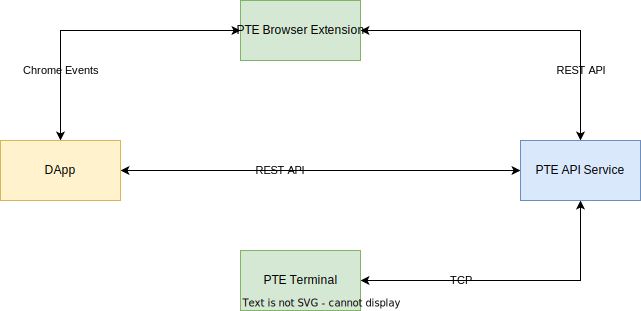

## Babylon Public Test Environment

Babylon Public Test Environment (PTE), a very simple public network simulator that will allow publishing of Scrypto blueprints and components along with composition using the new transaction manifest, with simulator tools sufficient to enable first experimentation with “full stack” dApp development including web front-ends

### Browser Extension

PTE Browser Extension is a proof-of-concept Chrome extension thats signs transactions using a local key pair.

You can download the prebuilt binaries from the [latest releases](https://github.com/radixdlt/babylon-pte/releases).

### Terminal

PTE Terminal is a command-line tool that connects to the PTE API service while exposing the same interface as `resim`.

You can download it from the [latest releases](https://github.com/radixdlt/babylon-pte/releases).

### API Specification

The specification of the PTE API service can be found [here](./pte-api-spec/api.yaml).

### Typescript SDKs

For DApp developers, three Typescript/Javascript SDKs are provided:

* `pte-sdk` - An SDK for constructing manifest and interacting with PTE service;
* `pte-browser-extension-sdk` - An SDK for interacting with PTE browser extension;
* `pte-manifest-compiler` - A library for compiling a manifest into a transaction.

### DApp Examples

Preliminary DApp examples can be provided [here](./examples/). 

Pull requests welcome.
